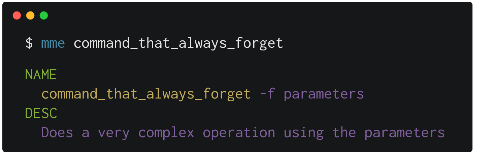

# 

[](https://travis-ci.org/GoberInfinity/mme)

mme is a search tool that helps you to print commands and their description using a custom file.



## Installation

The binary name for rememberme is mme.

[Archives of precompiled binaries for rememberme are available for macOS, Windows and Linux.](https://github.com/GoberInfinity/mme/releases)

## Usage

```
USAGE:
    mme [FLAGS] [OPTIONS] [word-to-search]

FLAGS:
    -a, --all        Displays all the commands and their descriptions
        --help       Prints help information
    -d, --desc       Searches the word only by descriptions
    -n, --name       Searches the word only by names
    -V, --version    Prints version information

OPTIONS:
    -h, --header-color <header-color>          Sets the color of NAME, DESC words
    -l, --highlight-color <highlight-color>    Sets the color of the word inside the text
        --path <path>                          Sets the path of the file where mme is going to search
    -t, --text-color <text-color>              Sets the color of the text

ARGS:
    <word-to-search>    Word to search in the file specified in the path

```

## Examples

#### Basic configuration

You need to specify the path of the file that contains your commands.

```bash
mme --path ~/my_commands
```

The file where `mme` is going to search must have the following structure:

```
# veryComplexCommand -a
> A very explanatory description

# veryComplexCommand
-b
-c
-d
> A very explanatory description
-b means b
-c means c
-d means d
```

The `#` indicates a command and `>` its corresponding description, you need to leave a blank line to separate the commands.

#### Extra configuration

You can change the color of the titles and the text. The available colors are: black, red, green, yellow, blue, purple, cyan and white.

```bash
mme --primary-color blue --secondary-color green
```

#### Searching

You can search by all (name and description):

```bash
mme veryComplexCommand
```

Only by name:

```bash
mme -n veryComplexCommand
```

Only by description:

```bash
mme -d veryComplexCommand
```

#### Special Searching

If you want to search a word with special characters you need to add `--` after you enter all the flags:

```bash
mme -d -- -something
```
